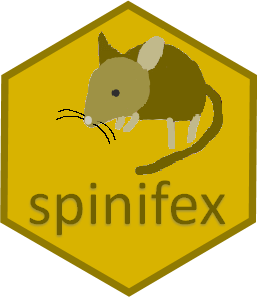

[](https://cran.r-project.org/package=spinifex) [](https://codecov.io/gh/nspyrison/spinifex?branch=master) [](https://cran.r-project.org/package=spinifex)

# spinifex 

## About tours

Data visualization *tour* is a class of linear projections that are animate small changes in a projection basis over time. Shadows are an example of a 3D object casting a 2D linear projection. Imagine a bar stool cast a circular shadow of its seat. Watching the shadow alone, a rotation of the objection would quickly give structural information about the object; when the legs are rotated into frame you can be more certain the object is a bar stool. In the same way, a tour watches a lower-dimensional projection of the data object. The object permanence of the observations between frames holds structural information that is revealed as the object is rotated.

<!---
This extends the number of dimensions that we can view in data-space! This is applicable to many visualizations across all disciplines. We know that going to numerical summarization alone is dangerous. We need look no further than Anscomb's quartet.


-->


## Scope

Such visualizations are applicable to numeric matrices which could be approximations of component spaces or feature decomposition of non-tabular data. Continuous quantitative variables are preferred, although ordinal discrete variables can also be used. Mapping color and/or shape to a (supervised) class tends to be helpful.


## Description

The `tourr` R package implements grand tours (constrained random walks in the basis), projection pursuit (basis anneals to some objective function), and several other variants and options of visualization tours.

__Grand tour__


The work and contribution of `spinifex` are primarily two-fold. The addition of manual tours which allow for user defined (and interactive!) control of the basis. Secondly, a layered API to create tour elements that mirrors the additive creation of `ggplot2` visuals. The extension to `gganimate` and `plotly` graphics packages, which allow for more control over display and exporting .gif, .mp4, and .html widgets of tours. The later can also consume tours produced in `tourr`!

We see that bill length is important for separating the orange and green species. Let's change its contribution with a manual tour:

__Manual tour__


## Getting started
```
library("spinifiex")                      ## Load into session
run_app("radial_tour")                    ## Run a local shiny app, demonstrating radial manual tours
vignette("getting started with spinifex") ## Introduction to tours and spinifex
vignette("ggproto api")                   ## Introduction to the new ggproto api
?ggtour                                   ## Examples and links to ggproto functions
help(package = "spinifex")                ## Review the package contents and documentation
```


## ggproto API

The ggproto API is a layered approach to the composition of animated tours, it should feel similar to the composition of ggplots.

| Family     | Function           | Related to          | Description                                             |
|------------|--------------------|---------------------|---------------------------------------------------------|
| processing | scale_01/sd        | -                   | scale each column to [01]/std dev away from the mean    |
| processing | basis_pca/olda/... | Rdimtools::do.*     | basis of orthogonal component spaces                    |
| processing | basis_half_circle  | -                   | basis with uniform contribution across half of a circle |
| processing | basis_guided       | tourr::guided_tour  | silently return the basis from a guided tour            |
| tour path  | manual_tour        | -                   | basis and interpolation information for a manual tour   |
| tour path  | save_history       | tourr::save_history | silent extended wrapper returning other tour arrays     |
| display    | ggtour             | ggplot2::ggplot     | canvas and initialization for a tour animation          |
| display    | proto_point/text   | geom_point/text     | adds observation points/text                            |
| display    | proto_density/2d   | geom_density/2d     | adds density curve/2d contours                          |
| display    | proto_hex          | geom_hex            | adds hexagonal heatmap of observations                  |
| display    | proto_basis/1d     | -                   | adds adding basis visual in a unit-circle/-rectangle    |
| display    | proto_origin/1d    | -                   | adds reference mark in the center of the data           |
| display    | proto_default/1d   | -                   | wrapper for proto_* point + basis + origin              |
| display    | facet_wrap_tour    | ggplot2::facet_wrap | facets on the levels of variable                        |
| display    | append_fixed_y     | -                   | add/overwrite a fixed vertical position                 |
| animation  | animate_plotly     | plotly::ggplotly    | render as an interactive html widget                    |
| animation  | animate_gganimate  | gganimate::animate  | render as a .gif .mp4 or other video format             |
| animation  | filmstrip          | -                   | static gpplot faceting on the frames of the animation   |

## Reporting issues

Please submit bug reports, errors, and feature requests to <https://github.com/nspyrison/spinifex/issues>
