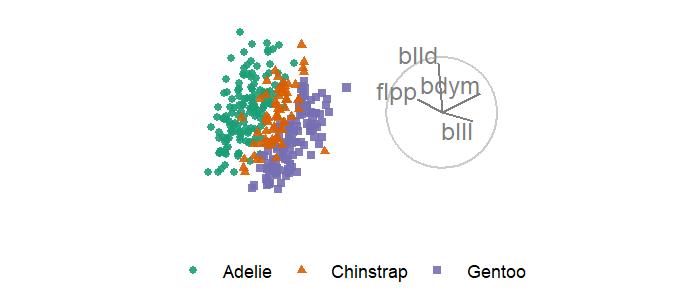
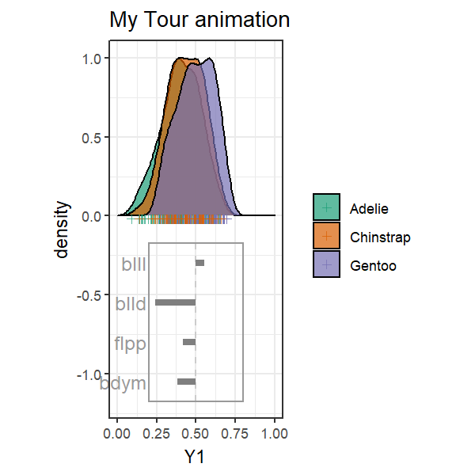

<!-- #Example vignette:
https://github.com/njtierney/naniar/blob/master/vignettes/getting-started-w-naniar.Rmd -->
```{r setup, include = FALSE}
knitr::opts_chunk$set(
  echo       = TRUE,   # code
  include    = TRUE,   # plots
  results    = "show", # text/html widgets: "hide", "show"
  eval       = TRUE,   # chunk
  message    = FALSE,
  warning    = FALSE,
  error      = FALSE,
  collapse   = TRUE,
  comment    = "#>",
  fig.height = 4,
  fig.width  = 6,
  fig.align  = "center",
  cache      = FALSE
)
```

__Gist:__ __ggplot2__ is used for a layered composition of static 1- and 2D graphics. We create functions to facilitate layered composition of dynamic animations of linear projections, _tours_. We parallel the composition of static graphics and try to abstract most of the complexity of replicating data and aesthetic mappings across many and changing number of interpolation frames.


## What is a proto?

We are moving to a new '`ggproto`' API for constructing animated tours from __ggplot2__ objects. This interface should feel more comfortable to people already familiar with __ggplot2__. Ggproto is the parent class of geoms, layers, and some other plotting elements.

Proto objects (or lists of them) can be assigned to a variable without `ggplot()`, they store _unevaluated_ code that will be used to plot. Let's see what this looks like in ggplot2 before we delve into tour animations.

```{r}
library("ggplot2")
library("magrittr")

## A ggproto:
gp <- geom_point()
class(gp)

## A list of ggplot elements, a 'head-less' ggplot call
gg_ls <- list(
  gp,
  geom_smooth(method = "loess", formula = y ~ x),
  ggtitle("proto_* functions return lists of geoms_* functions.",
          "These lists can be stored, extended, and added to ggplot(). 
          \n We use this to include the animation of ggplots."),
  facet_grid(cols = vars(Tree))
)
lapply(gg_ls, class)

## ggplot call, without geoms, a 'body-less' ggplot call
gghead <- ggplot(Orange, aes(age, circumference, color = Tree))

## Evaluate together
gghead +
  gg_ls
```

In the `ggproto` API we use this feature to create `proto_\*()` functions, the counter-parts of `geom_\*()` functions. These proto functions are used in composition with `ggtour()`, which replaces `ggplot()`, to create animated tours. In adopting this additive, composition approach we aim to maximize the flexibility for the end-users to customize tours while keeping the door open for extension of the development of further `proto` functions.

```{r, echo = FALSE}
data.frame(
  object = c("head", "body", "render"),
  ggplot2 = c("ggplot()", "geom_*()", "NA"),
  `ggproto api` = c("ggtour()", "proto_*()", "animate_*()"),
  `previous api` = c("play_manual_tour()", "play_manual_tour()", "play_manual_tour(render_*())")
) %>%
  knitr::kable()
```

`play_manual_tour()` abstracted away complexity, but it was becoming too big, and consuming workflow which a function should venue too far into. This made it too bloated to allow for some flexibility, but hard to understand all of the arguments. By paring back to `proto_\*` can keep details where they are more relevant without becoming overbearing in one monster function.

## Why 'proto_\*' instead of new 'geom_\*'

__spinifex__ `proto_\*` functions return a list of several `geom_\*` functions, that were designed to facilitate animation across many projection bases. We abstract away of work and complexity that comes with creating and animating tours, but this comes at the price of flexibility. For instance, protos do not know how to deal with facets and hard-code the number and type of geoms which would otherwise become very burdensome to specify all the specifics of.


## Application

### Manual tour

The manual tour varies the contribution of a selected variable. This can be used to explore the sensitivity of the variables contribution to the structure in a projection, such as cluster separation.

```{r, eval=FALSE}
library(tourr)
library(spinifex)

## Scale our numeric data
dat  <- scale_sd(penguins_na.rm[, 1:4])
## Use species as a class to set color and shape with
clas <- penguins_na.rm$species

## Manual tour, manipulating the contribution of a selected variable 
bas     <- basis_pca(dat)    ## Start basis
mv      <- 1 ## Number of the variable to manipulate
mt_path <- manual_tour(bas, manip_var = mv) ## Tour path

## Create a static ggplot2 plot with all frames of the tour
ggt <- ggtour(mt_path, dat, angle = .2) +
  proto_basis() +
  proto_point(aes_args = list(color = clas, shape = clas),
              identity_args = list(size = 1.5))

## Animate
animate_gganimate(ggt, height = 3, width = 4.5, units = "in", res = 150)
## Or as a plotly html widget
#animate_plotly(ggt)
```
```{r, echo=FALSE, out.width="100%"}
## Cut down sub-directory size, making animations to gif and including those.
if(FALSE){
  library(tourr)
  library(spinifex)
  dat  <- scale_sd(penguins_na.rm[, 1:4])
  clas <- penguins_na.rm$species
  bas     <- basis_pca(dat)    ## Start basis
  mv      <- 1 ## Number of the variable to manipulate
  mt_path <- manual_tour(bas, manip_var = mv) ## Tour path
  ggt <- ggtour(mt_path, dat, angle = .2) +
    proto_basis() +
    proto_point(aes_args = list(color = clas, shape = clas),
                identity_args = list(size = 1.5))
  anim <- animate_gganimate(ggt, height = 3, width = 4.5, units = "in", res = 150)
  gganimate::anim_save("proto_mt_penguins.gif", animation = anim, path = "./vignettes")
}
#
#knitr::include_url("https://github.com/nspyrison/spinifex/blob/master/vignettes/proto_mt_penguins.gif?raw=true")
```


### Grand tour, from __tourr__

This tour display composition works with other tours, such as those created with __tourr__.

```{r, eval=FALSE}
## Save a grand tour basis path, projecting through randomly selected bases
gt_path <- save_history(dat, grand_tour(), max_bases = 3)

## Static ggplot of all frames in the tour
ggt <- ggtour(gt_path, dat, angle = .2) + 
  ## angle is the distance between (geodesically) interpolated frames.
  proto_basis(position = "right") +
  proto_point(list(color = clas, shape = clas))

## Animate
animate_gganimate(ggt, height = 2, width = 4.5, units = "in", res = 150)
## Or as a plotly html widget
#animate_plotly(ggt)
```
```{r, echo=FALSE, out.width="100%"}
## Cut down sub-directory size, making animations to gif and including those.
if(FALSE){
  gt_path <- save_history(dat, grand_tour(), max_bases = 3)
  ggt <- ggtour(gt_path, dat, angle = .2) + 
    proto_basis(position = "right") +
    proto_point(list(color = clas, shape = clas))
  anim <- animate_gganimate(ggt, height = 2, width = 4.5, units = "in", res = 150)
  gganimate::anim_save("proto_gt_penguins.gif", animation = anim, path = "./vignettes")
}
#
#knitr::include_url("https://github.com/nspyrison/spinifex/blob/master/vignettes/proto_guided1d_penguins.gif?raw=true")
```


### 1D tours

We can also projection down to 1D with density curve and a unit rectangle basis instead.

```{r, eval=FALSE}
## (Quietly create) a 1d guided tour, optimizing the projection space for the holes() function
guided_path <- save_history(dat, guided_tour(holes(), d = 1))

## Static ggplot of all frames in the tour
ggt <- ggtour(guided_path, dat, angle = .2) +
  proto_basis1d() +
  proto_density(list(fill = clas, color = clas), rug_shape = 3)

## Animate
animate_gganimate(ggt, height = 2, width = 4.5, units = "in", res = 150)
## Or as a plotly html widget
#animate_plotly(ggt)
```
```{r, echo=FALSE, out.width="100%"}
## Cut down sub-directory size, making animations to gif and including those.
if(FALSE){
  guided_path <- save_history(dat, guided_tour(holes(), d = 1))
  ggt <- ggtour(guided_path, dat, angle = .2) +
    proto_basis1d() +
    proto_density(list(fill = clas, color = clas), rug_shape = 3)
  anim <- animate_gganimate(ggt, height = 2, width = 4.5, units = "in", res = 150)
  gganimate::anim_save(
    "proto_guided1d_penguins.gif", animation = anim, path = "./vignettes")
}
#
#knitr::include_url("https://github.com/nspyrison/spinifex/blob/master/vignettes/proto_guided1d_penguins.gif?raw=true")
```


### Interaction with ggplot2 functions

Because the output of `ggtour() + proto_\*` is a ggplot, themes and setting functions are interoperable.

```{r, eval=FALSE}
ggt <- ggt +
  theme_bw() +
  ggtitle("My Tour Animation") +
  labs(x = "Y1", y = "Density")

animate_gganimate(ggt, height = 2, width = 3, units = "in", res = 150)
## Or as a plotly html widget
#animate_plotly(ggt)
```
```{r, echo=FALSE, out.width="100%"}
## Cut down sub-directory size, making animations to gif and including those.
if(FALSE){
  ggt <- ggt +
    theme_bw() +
    ggtitle("My Tour animation") +
    labs(x = "Y1", y = "density")
  
  anim <- animate_gganimate(ggt, height = 4, width = 4, units = "in", res = 150)
  gganimate::anim_save(
    "proto_guided1d_interop_penguins.gif", animation = anim, path = "./vignettes")
}
#
#knitr::include_url("https://github.com/nspyrison/spinifex/blob/master/vignettes/proto_guided1d_interop_penguins.gif?raw=true")
```


### Faceting

In __ggplot2__ `facet_wrap` is used to create panels wrapping on levels from 1 or more categorical levels. We call `facet_wrap_tour` (before proto functions) to apply similar faceting to the `ggtour`.

```{r, eval=FALSE}
gt_path <- save_history(dat, max = 7)
ggt <- ggtour(gt_path, dat, angle = .3) +
  facet_wrap_tour(facet_var = clas, nrow = 1) +
  proto_point(list(color = clas, shape = clas)) +
  proto_basis(position = "center") +
  proto_origin()

animate_gganimate(ggt, height = 2, width = 6, units = "in", res = 150)
## Or as a plotly html widget
#animate_plotly(ggt)
```
```{r, echo=FALSE, out.width="100%"}
## Cut down sub-directory size, making animations to gif and including those.
if(FALSE){
  gt_path <- save_history(dat, max = 7)
  ggt     <- ggtour(gt_path, dat, angle = .3) +
    facet_wrap_tour(facet_var = clas, nrow = 1) +
    proto_point(list(color = clas, shape = clas)) +
    proto_basis(position = "center") +
    proto_origin()
  anim <- animate_gganimate(ggt, height = 2, width = 6, units = "in", res = 150)
  gganimate::anim_save(
    "proto_facet_penguins.gif", animation = anim, path = "./vignettes")
}
#
#knitr::include_url("https://github.com/nspyrison/spinifex/blob/master/vignettes/proto_facet_penguins.gif?raw=true")
```


## Proto functions

More protos will be added, especially as we find a use-case for them. Check the documentation for `ggtour`, all ggtour and proto related functions are linked in the See Also.

```{r, echo = FALSE}
data.frame(
  `proto functions` =
    c("ggtour", "proto_point", "proto_text", "proto_hex", "proto_origin/1d", "proto_density", "proto_basis/1d", "proto_default/1d", "animate_plotly", "animate_gganimate"),
  `related ggplot2 function` =
    c("ggplot", "geom_point", "geom_text", "geom_hex", "NA", "geom- _density & _rect", "geom- _segment & _text", "several protos", "plotly::ggplotly (with animation)", "gganimate::animate"),
  detail =
    c("Also perfroms setup for the tour.", "-", "-", "Heatmap hexegons, for high observation density", "Line segments for the origin, the space where 0 values project to", "1D density with run hash marks underneath, `position = 'stack'` not working with plotly.", "html widget, row numbers added as tooltip on hover. plotly doesn't presicly map all ggplot2 settings; legends, point size and opacity may vary.", "Direction and magnetude of variables to the projection disp~", "Default protos for 2/1D tours", "gif, mp4 and other video animation. gganimate consumes native ggplots and aestheics should be consistant."), check.names = F) %>%
  knitr::kable()
```

